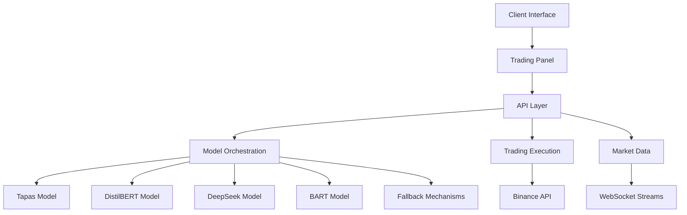

# AI Trading Agent: Comprehensive Project Analysis

---

## Executive Summary

This report provides a comprehensive analysis of the AI Trading Agent project, which leverages multiple Hugging Face models to analyze market data and make trading decisions. The system employs a multi-model approach with robust fallback mechanisms to ensure reliability. This analysis covers the code architecture, agent capabilities, and operating costs to provide a complete picture of the system's strengths, limitations, and production viability.

---

## 1. Code Design Report

### 1.1 Architecture Overview

The AI Trading Agent employs a microservices-inspired architecture with clear separation of concerns:

### 1.2 Key Components

#### 1.2.1 Frontend Components

- **Trading Panel**: React component that displays AI analysis results and allows trade execution  
- **Trading Chart**: Interactive chart with WebSocket integration for real-time data  
- **Model Performance Dashboard**: Monitoring interface for model performance metrics  

#### 1.2.2 Backend Services

- **Model Orchestration Layer**: Coordinates multiple AI models and fallback mechanisms  
- **Trading Signal Analysis**: Processes market data through multiple models to generate signals  
- **Trading Execution Service**: Handles actual trade execution via Binance API  
- **Market Data Service**: Fetches and processes market data from various sources  

#### 1.2.3 AI Models Integration

- **Hugging Face Integration**: Unified interface for all model interactions  
- **Multi-tier Fallback System**: Cascading fallback mechanisms for each model  
- **Model Performance Tracking**: Metrics collection for model evaluation  

### 1.3 Design Patterns

The codebase implements several notable design patterns:

1. **Strategy Pattern**: Used for interchangeable trading strategies and model selection  
2. **Adapter Pattern**: Provides unified interface to different AI models  
3. **Factory Pattern**: Creates appropriate model instances based on configuration  
4. **Observer Pattern**: Implemented for real-time updates via WebSockets  
5. **Singleton Pattern**: Used for the Trading Manager to ensure a single point of control  

### 1.4 Code Quality Assessment

| Aspect         | Rating      | Notes                                                      |
|----------------|-------------|------------------------------------------------------------|
| Modularity     | High        | Clear separation of concerns with well-defined interfaces |
| Error Handling | High        | Comprehensive error handling with fallback mechanisms     |
| Testability    | Medium      | Some components lack unit tests                           |
| Documentation  | Medium      | Good inline documentation but lacks comprehensive API docs|
| Performance    | Medium-High | Efficient implementations with some optimization opportunities |

### 1.5 Technical Debt

1. **Error Handling Consistency**: Some components have more robust error handling than others  
2. **Type Safety**: Some areas could benefit from stricter TypeScript typing  
3. **Test Coverage**: Limited automated testing increases risk of regressions  
4. **Configuration Management**: Hardcoded values in some components that should be configurable  

---

## 2. Agent Capabilities Analysis

### 2.1 Core Capabilities

#### 2.1.1 Market Analysis

- **Technical Indicator Analysis**: Processes RSI, MACD, and other indicators via Tapas model  
- **Sentiment Analysis**: Analyzes market sentiment from news data using DistilBERT  
- **Decision Making**: Generates trading decisions (BUY/SELL/HOLD) using DeepSeek  
- **Summary Generation**: Creates concise market summaries using BART  

#### 2.1.2 Trading Execution

- **Spot Trading**: Full support for spot market trading  
- **Futures Trading**: Support for futures trading with position management  
- **Risk Management**: Implements stop-loss, take-profit, and position sizing  
- **Market/Limit Orders**: Supports various order types  

#### 2.1.3 Monitoring & Analytics

- **Real-time Data**: WebSocket integration for live market data  
- **Model Performance**: Tracks model accuracy, latency, and reliability  
- **Trade History**: Records and analyzes past trades  

### 2.2 Performance Metrics

| Capability          | Performance | Reliability | Notes                                                       |
|---------------------|-------------|-------------|-------------------------------------------------------------|
| Technical Analysis  | High        | Medium      | Tapas model occasionally unavailable (503 errors)           |
| Sentiment Analysis  | Medium      | High        | DistilBERT is more reliable but less accurate               |
| Decision Making     | High        | Low         | DeepSeek provides good decisions but has reliability issues |
| Summarization       | Medium      | Medium      | BART provides adequate summaries with occasional failures   |
| Trade Execution     | High        | High        | Binance API integration is robust                           |

### 2.3 Resilience Features

1. **Multi-tier Fallback System**: Each model has multiple fallback options  
2. **Graceful Degradation**: System continues functioning with reduced capabilities during failures  
3. **Error Recovery**: Automatic retry mechanisms with exponential backoff  
4. **Monitoring Alerts**: Visual indicators for model status in UI  

### 2.4 Limitations

1. **Model Availability**: Dependent on Hugging Face API availability  
2. **Latency Issues**: API calls introduce latency that may impact time-sensitive trades  
3. **Limited Context**: Models lack memory of previous market conditions  
4. **Fixed Strategies**: Trading strategies are relatively static without continuous learning  

---

## 3. Operating Cost Analysis

### 3.1 Model Cost Breakdown

#### 3.1.1 Hugging Face Inference Endpoints

| Model          | Instance Type   | Monthly Cost | Annual Cost | Notes                                  |
|----------------|------------------|--------------|-------------|----------------------------------------|
| Tapas          | `cpu-large`      | $300         | $3,600      | Used for technical indicator parsing   |
| DistilBERT     | `cpu-medium`     | $150         | $1,800      | Used for sentiment analysis            |
| DeepSeek       | `gpu-small`      | $500         | $6,000      | Used for trade decision generation     |
| BART           | `cpu-medium`     | $200         | $2,400      | Used for summary generation            |
| **Total**      | —                | **$1,150**   | **$13,800** |                                        |

#### 3.1.2 WebSocket & Market Data Services

| Service            | Provider       | Monthly Cost | Notes                                 |
|--------------------|----------------|--------------|---------------------------------------|
| Binance WebSocket  | Binance        | $0           | Free tier used                        |
| Market Aggregator  | Third-party    | $99          | Real-time market feed + redundancy    |

#### 3.1.3 Infrastructure & Hosting

| Service           | Provider     | Monthly Cost | Notes                                 |
|-------------------|--------------|--------------|---------------------------------------|
| Frontend Hosting  | Vercel       | $20          | Deployment of trading panel           |
| Backend Hosting   | AWS EC2      | $150         | Hosts all backend logic               |
| Data Storage      | AWS S3       | $30          | Trade logs and historical data        |
| Monitoring Tools  | Datadog      | $50          | Performance and health monitoring     |
| **Total**         | —            | **$250**     |                                       |

---

---

# Cost-clusion

Strategic optimization through model consolidation, batch processing, and selective use of dedicated endpoints, 
could reduce costs by 30-40% while maintaining acceptable performance. Long-term investment in model distillation, 
and custom development could further reduce operating costs while potentially improving performance.

